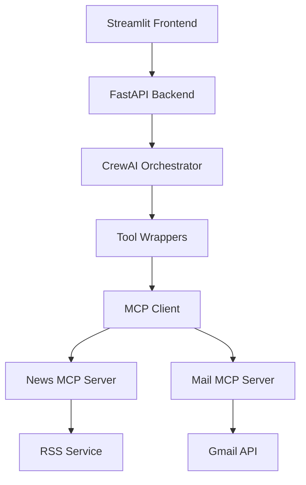
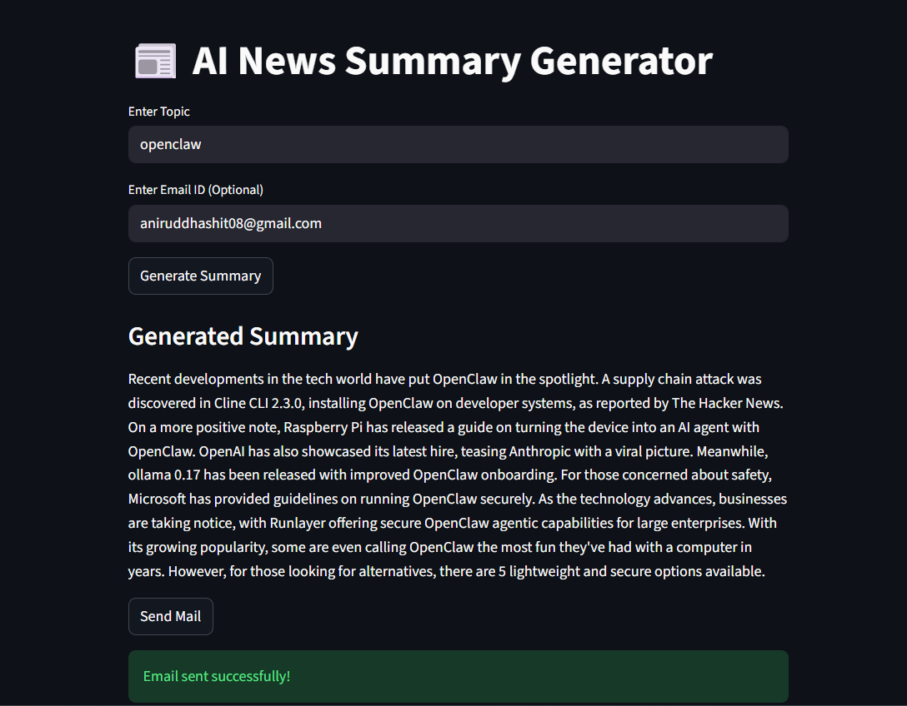

# 📰 Agentic AI News Summary & Email Sender
### (CrewAI + MCP + FastAPI + Streamlit)


---

# 📌 Overview

This project is a **microservice-based Agentic AI system** that:

✔ Fetches latest news on any topic  
✔ Generates a professional 160-word AI newsletter summary  
✔ Sends the summary via Gmail  
✔ Uses CrewAI for multi-agent orchestration  
✔ Uses MCP (Model Context Protocol) for tool communication  
✔ Provides Streamlit frontend + FastAPI backend  

This is a **portfolio-level production architecture**, not just a simple script.

---

# 🏗 System Architecture



---

# 🧠 How The System Works

## 1️⃣ Generate Summary Flow

User enters topic →  
Frontend calls `/generate` →  
CrewAI starts workflow →  
News Agent calls MCP →  
News Server fetches RSS →  
Writer Agent creates 160-word summary →  
Summary returned to UI  

---

## 2️⃣ Send Email Flow

There are two cases:

### Case A: Summary already generated
- User clicks **Send Mail**
- Backend directly calls Mail MCP server
- Email sent

### Case B: User clicks Send Mail first
- Backend automatically:
  - Generates summary
  - Sends email
- Fully automated workflow

---

# 🧩 Why MCP Is Used (Important)

We use:

```
Crew → Tool → MCP Client → MCP Server → Business Logic
```

## 🚀 Benefits

- Microservice-ready architecture
- Service isolation
- Replaceable components
- Scalable design
- Enterprise-style implementation
- Production-grade structure

---

# 📂 Project Structure

```
ai-news-agent/
│
├── app/
│   ├── agents.py
│   ├── crew.py
│   ├── llm.py
│   ├── main.py
│   ├── mcp_client.py
│   ├── tasks.py
│   ├── tools.py
│
├── backend/
│   └── main.py
│
├── frontend/
│   └── app.py
│
├── mcp_servers/
│   ├── news_server/
│   │   ├── server.py
│   │   ├── tools.py
│   │   └── services/
│   │       └── rss_service.py
│   │
│   ├── mail_server/
│   │   ├── server.py
│   │   └── auth.py
│
├── credentials.json  ❗ NOT INCLUDED
├── .env              ❗ NOT INCLUDED
└── README.md
```

---

# 🛠 Tech Stack

## 🤖 AI Layer
- CrewAI
- Groq LLM
- Multi-Agent Workflow

## 🔌 Protocol Layer
- MCP (Model Context Protocol)

## ⚙ Backend
- FastAPI
- Uvicorn

## 🖥 Frontend
- Streamlit

## 📡 APIs Used
- Google Gmail API
- Google News RSS

---

# 🔐 Gmail API Setup (Required)

⚠ `credentials.json` is NOT included because it contains private OAuth credentials.

---

## Step 1: Create Google Cloud Project

1. Go to: https://console.cloud.google.com
2. Create new project
3. Enable **Gmail API**

---

## Step 2: Create OAuth Credentials

1. Go to APIs & Services → Credentials  
2. Click "Create Credentials"  
3. Choose OAuth Client ID  
4. Select Desktop Application  
5. Download JSON  

Rename the downloaded file to:

```
credentials.json
```

Place it in the **root directory** of the project.

---

## ⚠ Why credentials.json Is Not Included

This file contains:

- Client ID
- Client Secret
- OAuth information

It must NEVER be pushed to GitHub.

Add this to `.gitignore`:

```
credentials.json
```

---

# 🔑 .env File Setup

Create `.env` in root directory:

```
GROQ_API_KEY=your_groq_api_key_here
CREWAI_TRACING_ENABLED=false
```

Add to `.gitignore`:

```
.env
```

---

## 📸 Application UI Preview

Below are screenshots of the Streamlit frontend demonstrating how the system works.

---

### 🖥️ 1️⃣ Home Screen – Topic & Email Input


**Description:**
- User enters the **news topic**
- User enters their **email address**
- Two main actions:
  - 🔎 Generate Summary
  - 📧 Send Mail

---

### 📰 2️⃣ Generated News Summary


**Description:**
- Displays AI-generated 160-word professional newsletter
- Clean and readable format
- Generated using:
  - MCP News Server (RSS-based fetching)
  - CrewAI Agent (Newsletter Writer)

---

### 📧 3️⃣ Email Sent Confirmation




**Description:**
- Sends the generated summary to the user’s email
- Uses Gmail MCP Server
- Confirms successful email delivery

---

## 🧠 Smart Workflow Behavior

The system behaves intelligently:

✔ If user clicks **Generate Summary** → Only summary is generated  
✔ If user clicks **Send Mail after generating** → The same visible summary is sent  
✔ If user clicks **Send Mail directly** → Entire workflow runs automatically:
   - Fetch news
   - Generate summary
   - Send email

No duplicate generation. No dummy emails.

---

---
# 📦 Installation

Clone repository:

```
git clone https://github.com/Aniru18/ai_news_sender.git
cd ai-news-agent
```

Install dependencies:

```
pip install fastapi uvicorn streamlit crewai crewai-tools mcp groq python-dotenv requests google-api-python-client google-auth google-auth-oauthlib google-auth-httplib2
```

---

# ▶ Running The Project

## 1️⃣ Start Backend

```
uvicorn backend.main:app --reload
```

## 2️⃣ Start Frontend

```
streamlit run frontend/app.py
```

---

# 🎯 Example Usage

1. Enter topic → Click Generate Summary  
2. Review summary in UI  
3. Enter email → Click Send Mail  

OR  

1. Enter topic + email  
2. Click Send Mail  
3. System auto-generates + sends  

---

# 🧠 Internal Agent Roles

| Agent | Responsibility |
|--------|----------------|
| News Research Analyst | Fetch headlines via MCP |
| Newsletter Writer | Generate 160-word summary |
| Email Dispatcher | Send final email via MCP |

---

# 🚀 Key Features

✔ Agentic AI Architecture  
✔ MCP-based microservices  
✔ Smart backend logic  
✔ Clean frontend UI  
✔ Production-ready design  
✔ No hardcoded emails  
✔ Fully dynamic workflow  

---

# 👨‍💻 Author

**Aniruddha Shit**  
AI Enthusiast  
India 🇮🇳

